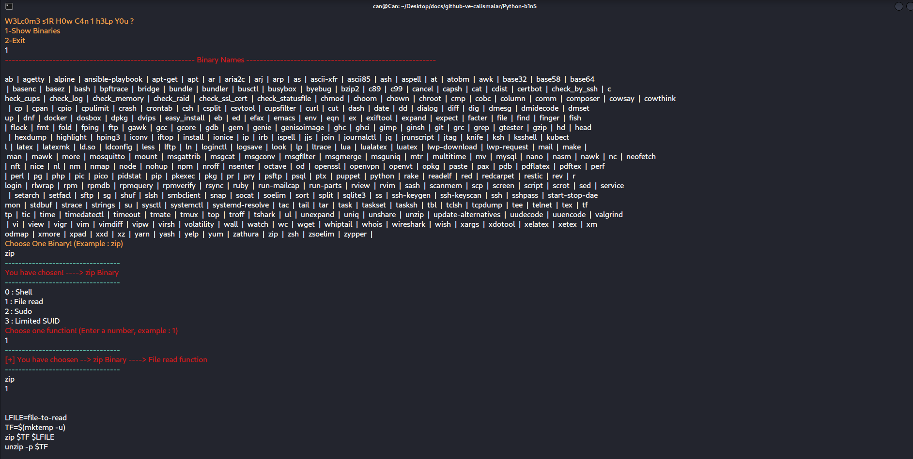

* It helps and make easier get data from gtfobins via command line.
* Listing all binaries at gtfobins.
* Listing all binaries's functions.

* https://github.com/GTFOBins
* https://gtfobins.github.io/
	

